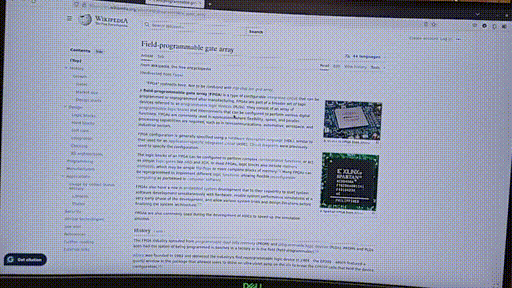

# ExternalGraphicCard

This Github repo contain the documentation for the USB-To-HDMI adapter(External Graphic Card) that I designed for my Senior Project.

The __USB To HDMI Adapter__(External Graphic Card) is an attempt to reproduce device that is similar to Startech's [USB32HD4k](https://www.startech.com/en-us/display-video-adapters/usb32hd4k) device that works on Linux, Ubuntu specifically. 

Currently, the device support video streaming up to 1080p at 30HZ. 

The device is compatible to most linux distribution that support by [evdi](https://github.com/DisplayLink/evdi). Currently, the device is tested and verified on Ubuntu 20.04.

When plugging the USb 3.0 Device into the host laptop and launch the C++ program, a new display monitor will be registered in OS and image data will stream out from the USb 3.0 port to the FPGA and output in HDMI signal.

**For more info**, please refer to the [user manual](Usermanual.md), [Technical Manual](TechnicalMaunaul.md), and the [Fabrication Plan Manual](./FabricationMaunal.md)

# Demonstration

## Video & Sound in Sync
[Video link](https://github.com/joeldushouyu/ExternalGraphicCard/blob/main/videoDirectory/video-sync.mp4)

## Drag window across monitors
[Video link](https://github.com/joeldushouyu/ExternalGraphicCard/blob/main/videoDirectory/drag-window-between-monitors.mp4)

## Browing  website
[Video link](https://github.com/joeldushouyu/ExternalGraphicCard/blob/main/videoDirectory/browsing-website.mp4)

