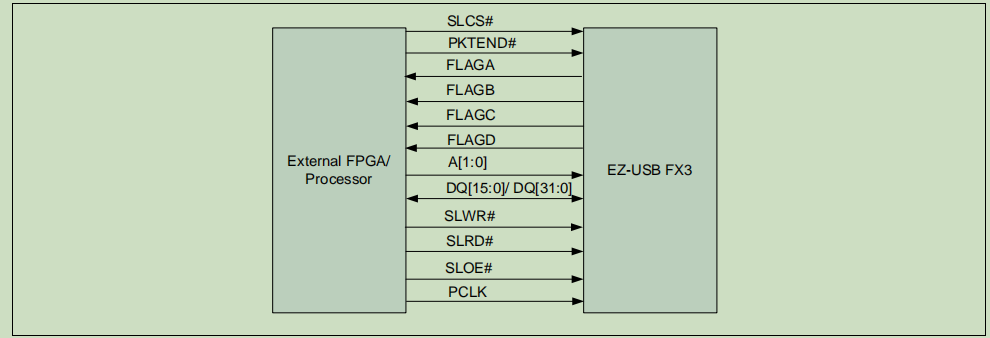
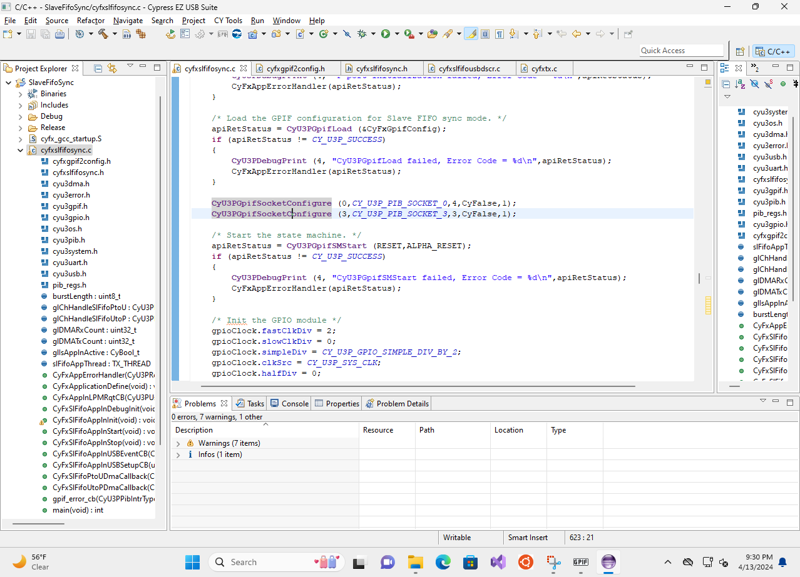

# Theory of Operation

### Figure 1: Concept Diagram


The device consists of 3 Major components, the __C++ program__ on the host laptop, the __CYUSB 3014 Evaluation board__, and __ULX3s__.


### C++ program on the host laptop
The C++ program on the laptop is mainly responsible for interacting with the OS to create a virtualized screen and transmit video data through USB 3.0 protocol to the CYUSB3014 device. Notably, DisplayLink, a company that sells existing USB-to-HDMI display adapters, has open-sourced part of their code to the public on Github, the [evdi](https://github.com/DisplayLink/evdi) repo. The project provides detailed documentation on their API. In addition, the repo contains a C++ based python-binding test program. 


### CYUSB3014 Device

The CyUSB3014 Device is an [evaluation board](https://www.infineon.com/cms/en/product/evaluation-boards/cyusb3kit-003/) produced by Infineon Technologies. The evaluation board consists of a CYUSB3014 programmable IC, which supports USB 3.0 communication protocol and provides a Slave Fifo Interface that allows FPGA/micro-controllers to read and write data to the fifo to interact between the USB 3.0 host device.  

 **Note**: for more information regarding the configuration below, please refer to [An65974](./ReferenceDataSheet/Infineon-AN65974_Designing_with_the_EZ-USB_FX3_Slave_FIFO_Interface-ApplicationNotes-v17_00-EN.pdf) document from Infineon Technologies. 

### Figure 2: Synchronous slave Fifo interface 

The [An65974](./ReferenceDataSheet/Infineon-AN65974_Designing_with_the_EZ-USB_FX3_Slave_FIFO_Interface-ApplicationNotes-v17_00-EN.pdf) document provides the Synchronous slave FIFO between External FPGA, as shown in Figure 2. 

In Figure 2, SLCS, SLWR, SLRD, SLOE, PKTEND, and A[1:0] are the combination of signal wires that are used by FPGA to control whether it wants to read or write to the FIFO on CyUSB3014. The PCLK is the slave FIFO interface clock from the FPGA to CyUSB3014 device, which supports up to 100MHZ. Thus, the synchronous slave FIFO mode theoretically supports up to 320Mbit/s transfer rate. For a faster transfer rate, please refer to the async fifo mode of CyUSB3014.

Moreover, FLAGA, FLAGB, FLAGC, and FLAGD are flag outputs from CyUSB3014 to indicate whether the FIFO is full/empty, or almost full/empty to FPGA. 

### ULX3s

The ULX3s is an open-sourced ECP5 [FPGA board](https://radiona.org/ulx3s/) designed by Radiona. The Ulx3s board is built around the Lattice Semiconductor ECP5-series FPGA chip and is fully supported by the latest open-source toolchains. The board consists of 56 pins (28 differential pairs), 2 USB 2.0 ports, 11 LEDs, and a Digital video (GPDI General-purpose Differential Interface). For more detail regarding to the board, please refer to the [information](https://www.crowdsupply.com/radiona/ulx3s) on CrowSupply.


## How it all work together

### Figure 3 Verilog Design


For the [C++ program](https://github.com/joeldushouyu/evdi/blob/userProgram/userProgram/main.cpp) that run on host laptop, I simply __forked__ the evdi repo, **extracted** the C++ framework that was used in the python-binding test program, create a c++ program that calls the function in the __extracted__ C++ framework.
Given the evdi library implemented a non-blocking file descriptor under the hood, I simply added a [usleep](https://github.com/joeldushouyu/evdi/blob/userProgram/userProgram/main.cpp#L211) function call in the main event-handler loop for interacting with evdi library. In addition, considering the importance of smooth video data streaming and the **huge** I/O delay in using the __synchronous__ api of [libusb](https://github.com/libusb/libusb), I decide to use the __asynchronous__ API of libusb and start new [thread](https://github.com/joeldushouyu/evdi/blob/userProgram/userProgram/main.cpp#L205) in the program for handling libusb callback-event. To sync between the new frame data generated by the evdi [event-loop](https://github.com/joeldushouyu/evdi/blob/userProgram/userProgram/main.cpp#L210) and the frame data sent off by libusb [event-loop](https://github.com/joeldushouyu/evdi/blob/userProgram/userProgram/main.cpp#L187), similar to the famous **[Produce-consumer problem](https://en.wikipedia.org/wiki/Producer%E2%80%93consumer_problem)**, I added a mutex lock and a deque in [Card.h](https://github.com/joeldushouyu/evdi/blob/userProgram/userProgram/Card.h#L69-L70). Essentially, both the evdi [event-handler](https://github.com/joeldushouyu/evdi/blob/userProgram/userProgram/Card.cpp#L214) and libusb [callback](https://github.com/joeldushouyu/evdi/blob/userProgram/userProgram/main.cpp#L103) need to acquire the __exclusive__ mutex lock when adding or retrieving frame data from the dequeue.


Assuming the CyUSB3014 device is pre-configured into synchronous slave-fifo mode, upon receiving USB data from the host laptop, the Cyusb3014 IC pushes the data to the internal buffer and notifies the ULX3s FPGA board by toggling both FLAGC and FLAGD wire (for more detail, please see the configuration part of CyUSB3014 board). 

The [Verilog program](https://github.com/joeldushouyu/ulx3s-misc/tree/doubleFIFOImplementation/examples/dvi) is forked and modified the existing [HDMI video output Verilog demo](https://github.com/emard/ulx3s-misc/tree/master/examples/dvi). The overall structure of the verilog code is shown in Figure 3. In the Verilog program, I modified the [Async fifo](https://github.com/joeldushouyu/async_fifo/tree/doubleFifoBuffer) project to create a double FiFo. The first FIFO is configured to be [4096 word size](https://github.com/joeldushouyu/ulx3s-misc/blob/doubleFIFOImplementation/examples/dvi/top/top_usbtest.v#L890) and the second FIFO is configured to be [64-word size](https://github.com/joeldushouyu/ulx3s-misc/blob/doubleFIFOImplementation/examples/dvi/top/top_usbtest.v#L891). The FPGA start out in __IDLE__ state with both FIFO empty. Once the CyUSB3014 board toggle FLAGC and FLAGD wire that indicate available data and FIFO1 indicate is empty, the FPGA goes to **Stream_Out** mode to read 4096 words from CyUSB3014 and write to FIFO1. After the data passes from FIFO1 to FIFO2 and indicates data available to __HDMI Output Module__, the __HDMI Output Module__ enables the __Enable Read__ wire and start reading video data from FIFO2 and convert to HDMI signal.

**Note** Given CyUSB3014 is set up to 32 bit, the __word size__ should be configured to 32 bit. However, the __word size__ is currently configured to [16 bit](https://github.com/joeldushouyu/ulx3s-misc/blob/doubleFIFOImplementation/examples/dvi/top/top_usbtest.v#L888) due to issue with the PCB board design. For more info, please refer to the __Notes in "Schematics and Drawings"__ section.

**Note** Currently, there is a [bug](https://github.com/dpretet/async_fifo/pull/13) I found in the async_fifo after adding [parameters for threshold value](https://github.com/dpretet/async_fifo/pull/11). Once the PR I submitted is merged, I will need to re-merge the [doube-fifo branch](https://github.com/joeldushouyu/async_fifo/tree/doubleFifoBuffer) that I used for this project with the [main branch](https://github.com/dpretet/async_fifo) 


# Schematics and Drawings

### Schematic 1: Circuit Schematic


### Schematic 2: Top Layer PCB


### Schematic 3: Bottom Layer PCB


**Problem 1** Due to the incorrect measurement, the current PCB layout board only fits to __16 bit bus wide__ of Cyusb3014. 

**Problem 2** The PCB board design did not consider the possible trace length difference between the I/O pins on __ULX3s__. Thus, data will be distorted at clock frequency __higher__ than __60MHZ__.


# Bill of Materials
|Part Name| Part Number | Vendor Name | Web Address| Note|
|---------|-------------|-------------|------------|-----|
|ULX3s    | CS-ULX3S-01 | Mouser Electronics| https://www.mouser.com/ProductDetail/Radiona/CS-ULX3S-01?qs=hWgE7mdIu5Sz6R%252BJENFe0A%3D%3D| Could get the 12F version for a cheaper price|
|PCB board connector pin| B08DVGCTKT | Amazon| https://www.amazon.com/dp/B08DVGCTKT?psc=1&ref=ppx_yo2ov_dt_b_product_details| |
|CyUSB3014 Evaluation board | 	CYUSB301x | Mouser Electronics|  https://www.mouser.com/ProductDetail/727-CYUSB3KIT-003| |
|PCB Conversion Board | Standard PCB/PCBA | JLCPCB | https://jlcpcb.com | Could potentially produce the board with other online sellers, see detail in __Manufacture__ section |


# Prerequisite & Manufacturing Details


## 1. Install software for building the verilog project
Setup Yosys and tools for compiling the ULX3s by following the README.md guide in [oss-cad-suite-build](https://github.com/YosysHQ/oss-cad-suite-build).
**Note** You might want to consider adding the following line into your bashrc file to save you the headache of sourcing the environment at your terminal. 
```bash 
export PATH="<extracted_location>/oss-cad-suite/bin:$PATH"
```

Also, add the [vhdlv](https://github.com/ldoolitt/vhd2vl) project by
    1. clone and build the vhdlv project
    2. add the build result to __PATH__ variable in .bashrc, just like above.
## 2. Setup the evid library
### Step 1
Option 1 (**preferred** & tested version): Install the correspond linux driver by following the user manual from Displaylink for [Ubuntu](https://www.synaptics.com/products/displaylink-graphics/downloads/ubuntu) or [Other Linux Distribution](https://support.displaylink.com/knowledgebase/articles/679060)

Option 2: Clone the [evdi](https://github.com/DisplayLink/evdi) and follow the [install guide](https://github.com/DisplayLink/evdi/issues/413)

### Step 2
Clone  My Forked branch that contains modified [User Program code](https://github.com/joeldushouyu/evdi). 

**NOTE:** The modified User program code is in the **userProgram** branch,**not in** the __main__ branch!

### Step 3
Add the following line into __.bashrc__ or any __shell program__ you are using.
```sh
    export LD_LIBRARY_PATH=$LD_LIBRARY_PATH:/PathOFCloneEvdiProject/evdi/library
```
## 3. Setup CyUSB3014 device

**NOTE** Currently, the GPIFII tool from Cypress **only works on Windows platform**, thus I have to configure Cypress in the VMWare that runs Windows 11.

For More __detail__ on loading configured image to CyUSB3014, please refer to [AN76405](./ReferenceDataSheet/Infineon-AN76405_-EZ-USB_FX3_FX3S_boot_options-ApplicationNotes-v12_00-EN.pdf) documnt, **page 28**.


### step 1: install driver
Download and install the [windows driver](https://softwaretools.infineon.com/tools/com.ifx.tb.tool.ezusbfx3sdk?_ga=2.95769944.599421172.1713027498-730138625.1705435601) for CyUSB3014 device.

### step 2: Configure Wire mapping in GPIF II designer
To configure the FlagA,B,C, and D flag wires on CyUSB 3014, one needs to use __GPIF II designer__.

**Open** GPIF II designer and open the existing **sync_slave_fifo_2bit** example


Choose **File->Save Project As Editable** to save a new copy of the project. **Close** the current GPIF II project and reopen the __new__ copy of the project.


Modify the settings under __Interface Settings__ to add all 4 FLAG wires to the pin-mapping.


**Right click** on FlagA in the __I/O MatrixConfiguration__ and select **DMA Flag Settings**


Configure the setting for **FlagA** to be Full flag dedicated to thread0 for Stream_IN data transfer, see more on Page 33 of [An65974](./ReferenceDataSheet/Infineon-AN65974_Designing_with_the_EZ-USB_FX3_Slave_FIFO_Interface-ApplicationNotes-v17_00-EN.pdf) document.


Configure the setting for **FlagB** to be Partial Flag with watermark dedicated to thread0.


Configure the setting for **FlagC** to be Full flag dedicated to thread 3 for Stream_Out data transfer/


Configure the setting for **FlagD** to be Partial Flag with watermark dedicated to thread3.


Choose **Build->Build Project** to build the project.

The build job will generate a **cyfxgpif2config.h** file inside the project folder. The content of the file should closely match the existing [cyfxgpif2config.h](./CypressFx3Configuration/my_slave.cydsn/cyfxgpif2config.h). **Note**: The content of the file could vary due to different firmware version in the feature, but the overall I/O mapping MACRO should be the same (Unless there is a design change in CyUSB3014 IC and board layout).

### step 3: Import & build CyUSB3014 Project
Navigate to the folder where the firmware of CyUsb3014 is installed on Windows. For my case, the firmware is installed in __C:\Program Files (x86)\Cypress\EZ-USB FX3 SDK\1.3\firmware__. 

Copy the __slfifosync__ in ***C:\Program Files (x86)\Cypress\EZ-USB FX3 SDK\1.3\firmware\slavefifo_examples*** to a different location. 

**Copy** the **cyfxgpif2config.h** from __GPIF II Designer__ build above into the **newly copied** __Slfifosync__ folder.   


__Launch__ ***EZ USB SUITE***, choose **File->Import** to import the newly copied __slfifosync__ version.


In __cyfxslfifosync.c__ file, set the watermark for Thread0 to 4 and Thread 3 to 3. Doing so allows FlagB to turn from high-to-low immediately after the FIFO is full for stream_In and FlagD to turn from high-to-low immediately after the FIFO is empty for Stream_Out. For more detail regarding to the __Watermark__ configuration, please refer to __Section 9.3__ of [An65974](./ReferenceDataSheet/Infineon-AN65974_Designing_with_the_EZ-USB_FX3_Slave_FIFO_Interface-ApplicationNotes-v17_00-EN.pdf) document.


**Add** the following code to __cyfxslfifosync.h__ to configure the FIFO size for both stream_In and stream_Out. 
```c++
/* set up DMA channel for stream IN/OUT transfers */
#define STREAM_IN_OUT
// code in between ........

#ifdef STREAM_IN_OUT
#define BURST_LEN 16
#define DMA_BUF_SIZE						 (16)
/* Slave FIFO P_2_U channel buffer count */
#define CY_FX_SLFIFO_DMA_BUF_COUNT_P_2_U      (2)
/* Slave FIFO U_2_P channel buffer count */
#define CY_FX_SLFIFO_DMA_BUF_COUNT_U_2_P 	  (10)
#endif
```

**Note** Given the fact that for our application, we are ___only configuring___ CyUSB 3014 board in stream_out mode( read from CyUSB3014 to FPGA) and only use stream_in mode for ___debug___, we assign a larger size on the ***stream_out*** fifo. Thus, we allocate a bigger FIFO size for stream_out compare to the instruction in [An65974](./ReferenceDataSheet/Infineon-AN65974_Designing_with_the_EZ-USB_FX3_Slave_FIFO_Interface-ApplicationNotes-v17_00-EN.pdf) document. For more detail, please refer to **page 36** of [An65974](./ReferenceDataSheet/Infineon-AN65974_Designing_with_the_EZ-USB_FX3_Slave_FIFO_Interface-ApplicationNotes-v17_00-EN.pdf) document.

By now, the content of __slfifosync__ should be nearly identical to the [existing configuration ](./CypressFx3Configuration/SlaveFifoSync/). **Note**: The content of the file could vary due to different firmware versions in the feature, but the overall code should be similar.


Choose **Release** build mode and build the
[project](./CypressFx3Configuration/my_slave.cydsn/).
.

By this time, a __SlaveFifoSync.img__ should exist under the [Release](./CypressFx3Configuration/SlaveFifoSync/Release/) sub-folder.

### step4 : Load build image to CyUSB3014 in I2C mode

Configure CyUSB3014 device into PMODE by placing the Jumper Cap on __J4__ and a Jump wire that connects **PM_1** and **V3P3** pins on the board.


Plug the CyUSB3014 device into the USB 3.0 port and launch __USB Control Center__.

Select **Program->Fx3->I2C EEPROM** 


Navigate to find  __SlaveFifoSync.img__  under the [Release](./CypressFx3Configuration/SlaveFifoSync/Release/) sub-folder.


Press **Open** and the software will start loading __SlaveFifoSync.img__ into CyUSB3014 device. This process might take about **5 minute.**

**Once finished** loading __SlaveFifoSync.img__, **unplug** CyUSB3014 from the laptop and **remove both** the ***jumper cap and jumper wire***.

## 4. Compile the verilog program
### step 1: Clone modified ulx3s-misc project
Clone My Forked Branch of [ulx3s-misc](https://github.com/joeldushouyu/ulx3s-misc). 

**NOTE** The current verilog code is in the __doubleFIFOImplementation__ branch. Be sure to check out the [__doubleFIFOImplementation__](https://github.com/joeldushouyu/ulx3s-misc/tree/doubleFIFOImplementation) branch after cloning.

### step 2 : Initialize the async_fifo git submodule
***cd*** into the directory of ***/ulx3s-misc-colonePath/examples/dvi*** and run the following command in the terminal.

**Note** Currently, I submit an [PR](https://github.com/dpretet/async_fifo/pull/13) that is supposed to fix the Bug that I found using the [async_fifo](https://github.com/dpretet/async_fifo). Once the PR got merged, I will need to sync the [doubleFifoBuffer](https://github.com/joeldushouyu/async_fifo/tree/doubleFifoBuffer) with the main branch.

```bash
    git submodule init
    git submodule 
```
### step 3 : Build the FPGA project
Modify the [FPGA_SIZE](https://github.com/joeldushouyu/ulx3s-misc/blob/doubleFIFOImplementation/examples/dvi/makefile.trellis#L5) in the Makefile base on the version of ULX3s you have. 

Compile the programming by running the following command in the terminal.
```bash
make
```
