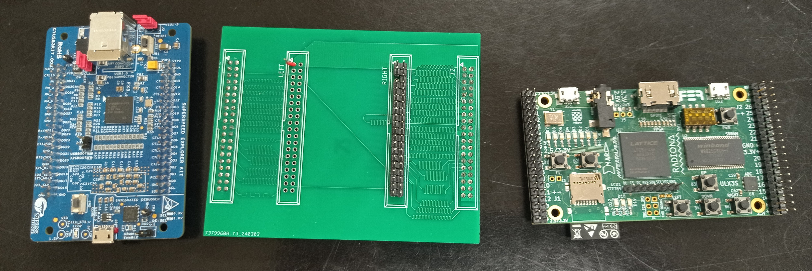
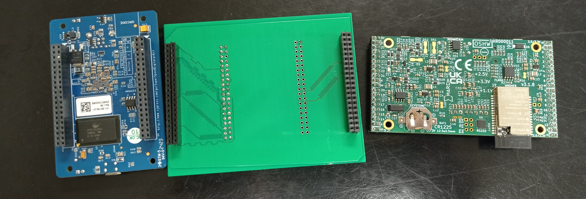
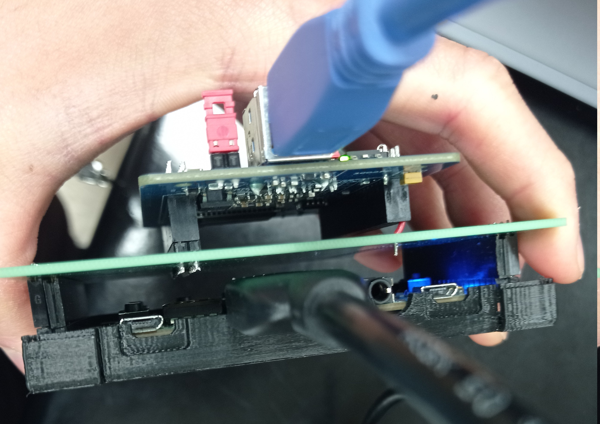
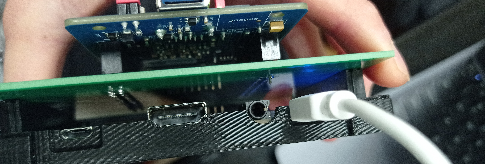
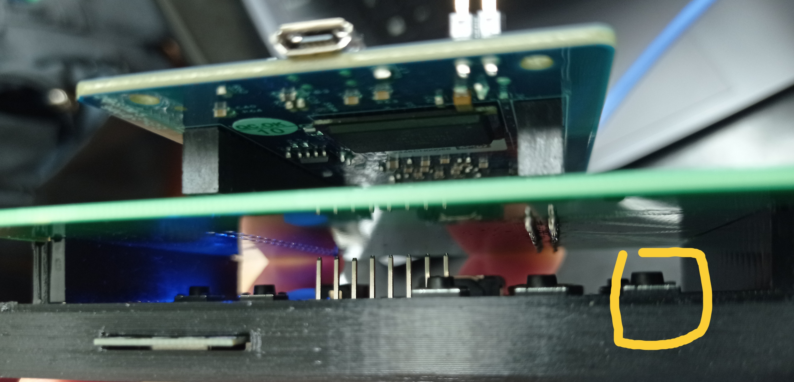

# Introduction

The __USB To HDMI Adapter__(External Graphic Card) is an attempt to reproduce a device that is similar to Startech's [USB32HD4k](https://www.startech.com/en-us/display-video-adapters/usb32hd4k) device that works on Linux, Ubuntu specifically. 

Currently, the device supports video streaming up to 1080p at 30HZ. 

The device is compatible to most linux distribution that support by [evdi](https://github.com/DisplayLink/evdi). Currently, the device is tested and verified on Ubuntu 20.04.

# Safety
Given the device is only powered by the USB 3.0 port (around 5 Watt), the device does not introduce the risk of electrical shock and injury in any situation. 

However, please keep the device **away** from water split and  **do not** use the device in any wet conditions. Doing so could damage the device!


# Description & Terminology
1. [C++ user program](https://github.com/joeldushouyu/evdi/tree/userProgram/userProgram) - C++ code that utilize [evdi](https://github.com/DisplayLink/evdi) to create a virtual screen in the Linux-based OS.
2. Host laptop - The laptop/computer that runs the C++ program that generates video data.
3. CyUSB3014 - A Cypress [USB 3014 Evaluation board](https://www.infineon.com/cms/en/product/evaluation-boards/cyusb3kit-003/) produced by Infineon. Left component in Figure 1 and Figure 2.
4. ULX3s - An open-sourced ECP5 [FPGA board](https://radiona.org/ulx3s/) designed by Radiona. The right component in Figure 1 and Figure 2

5. PCB Conversion board - A customized design double-layer PCB board that connects the pins between CyUSB3014 and ULX3s. Moreover, the board utilizes the Vcc pins on CyUSB3014 to power the ULX3s device.  The middle component of Figure 1 and Figure 2.

#### Figure 1: Front View of Component

#### Figure 2: Back view of the Component



# Installation Procedure
## 1. Connect the USB 3.0 wire
Connect the USB 3.0 Wire to the USB 3.0 Port on CyUSB3014 and connect the other end of the wire to USB 3.0 port on laptop. 

## 2. Connect the HDMI cable
Connect the HDMI cable to the HDMI port on ULX3s.

## 3. (**Optional**: only require if never flashed the verilog code to ULX3s)

Connect the Micro USB 2.0 cable to the FPGA. Navigate to ***/ulx3s-misc-colonePath/examples/dvi*** (Refer to STEP 4 in __Prerequsite__ section of [TechnicalManual](./TechnicalMaunaul.md)), run the following command to flash the Verilog code to FPGA.
```bash
./loadToFlash.sh
```



# Instruction/Operation

### Step 1: Navigate to the modified Edid project
___cd___ to ___/pathOfClonedEdid/userProgram___ (refer to step 5 of **prerequisite** in [TechnicalManual](./TechnicalMaunaul.md)) 
### Step 2: Configure Screen Resolution in C++ code
Modify the [Line 199-2002](https://github.com/joeldushouyu/evdi/blob/userProgram/userProgram/main.cpp#L199-L202) in Main.cpp to select the EDID file that match to the desired screen information.

**NOTE**: To generate edid file for a screen resolution that is not included in the GitHub repo, please check out the [EDID](https://github.com/linuxhw/EDID) project by searching the [AnalogDisplay.md](https://github.com/linuxhw/EDID/blob/master/AnalogDisplay.md). Once located the did file, run the bash instruction under [How to install EDID file](https://github.com/linuxhw/EDID) and copy the new edid binary file to the project folder.

### Step 3: Build the C++ program
Run the following code to compile the program
```sh
make clean
make
```
### step 4 (Only when modified resolution setting in step 2 / Modified verilog code)
***cd*** to into the directory of ***/ulx3s-misc-colonePath/examples/dvi***  (refer to step 4 of __Prerequisite__ in [TechnicalManual](./TechnicalMaunaul.md) )

Modify [line 1-3](https://github.com/joeldushouyu/ulx3s-misc/blob/doubleFIFOImplementation/examples/dvi/top/top_usbtest.v#L1-L3) of top_usbtest.v

**NOTE** Due to the imperfect design of the PCB Conversion board, the current support resolution is listed below. For more details on the PCB conversion board, please refer to the [technical manual](./TechnicalMaunaul.md). **The list will be updated once a better PCB board design comes out**

|Resolution| FPS|
|--|--|
|640x400|30 or 60 HZ|
|640x480|30 or 60 HZ|
|720x576|30 HZ|
|800x480|30 HZ|
|1366x768|30 HZ|
|1280x1024|30 HZ|
|1920x1080|**25** HZ|

Re-compile the Verilog code and flash the Verilog by running the following command.
```bash
./loadToFlash.sh
```
### step 5 : Reset the FPGA state
Press the reset button for about __5 seconds__. 

**NOTE** Currently, the reset button is configured to be the right movement button(see Picture below). You are welcome to reconfigure the button by making change in the [verilog code](https://github.com/joeldushouyu/ulx3s-misc/blob/doubleFIFOImplementation/examples/dvi/top/top_usbtest.v#L88). However, be sure to remember to recompile and re-flash the verilog code after your change, refer to step 4 of **Instruction/Operation** .

### step 6 :  Launch the C++ program
___cd___ back to ___/pathOfClonedEdid/userProgram___ ( refer in step 1 of __Instruction/Operation__ ) and run the following command
```bash
./main
```

After __a few seconds__, the screen will blink and the monitor will show the newly configured screen.


# Troubleshooting
1. When the screen is distorted or out of the image
    1. First close the ./main program on the laptop by press ctrl+c
    2. Press the __reset__ button(refer to step 5 of __Instruction/Operation__) for around __5 seconds__ or longer. 
    3. Rerun the ./main program
2. When No image is showing on the monitor
    Refer to the __Instruction/Operation__ section to choose a lower/higher resolution screen setting. 


# Further Support / Assistant
If you have any issues or questions regarding the project, please create a new issue in the Github Repo and mention me in the discussion.  I will try my best to respond to the question as soon as possible.


    

 
